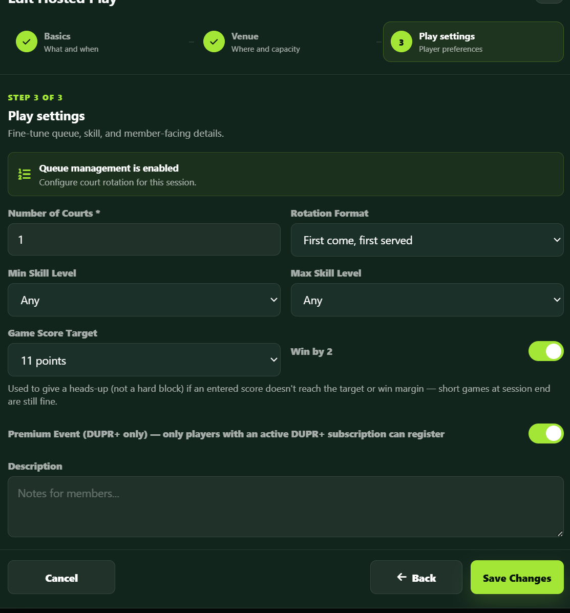
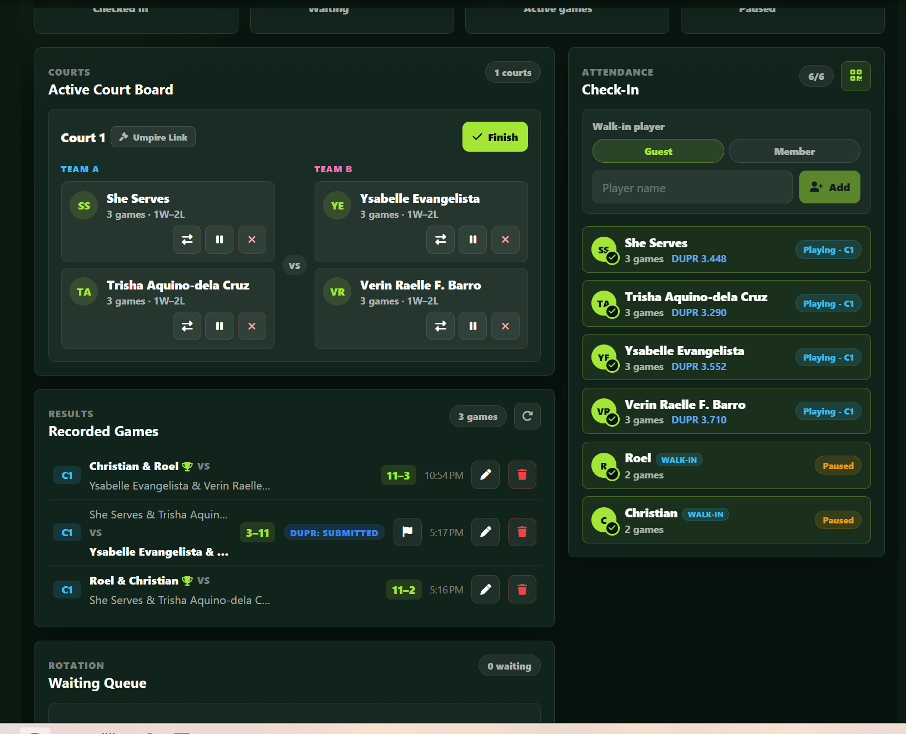
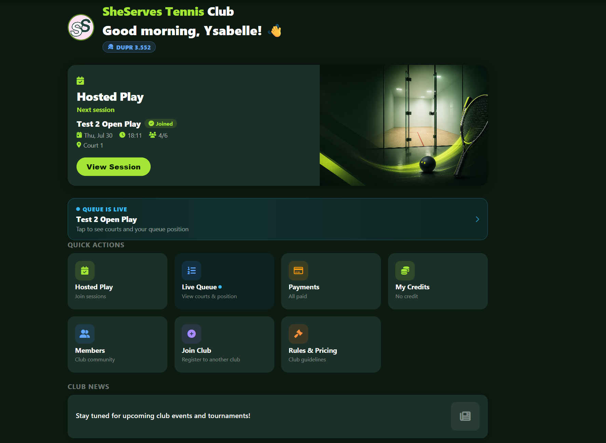
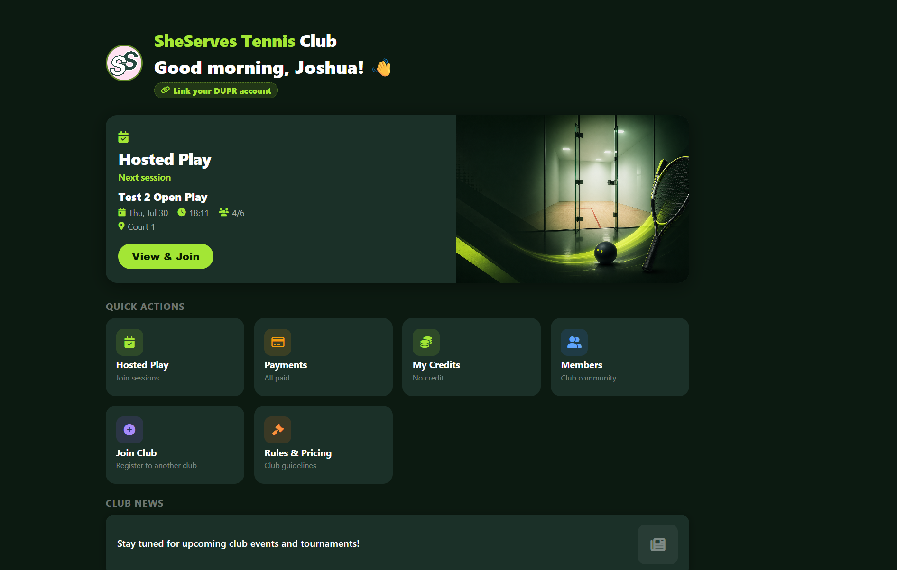
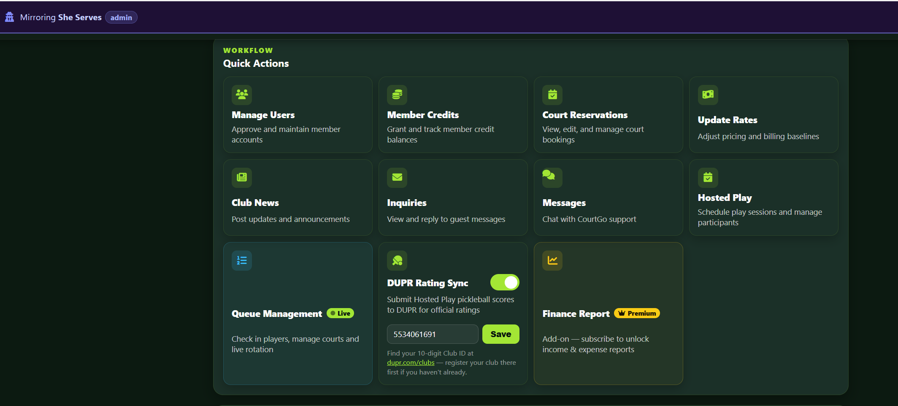
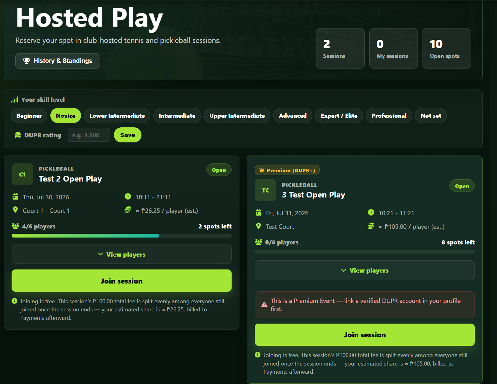
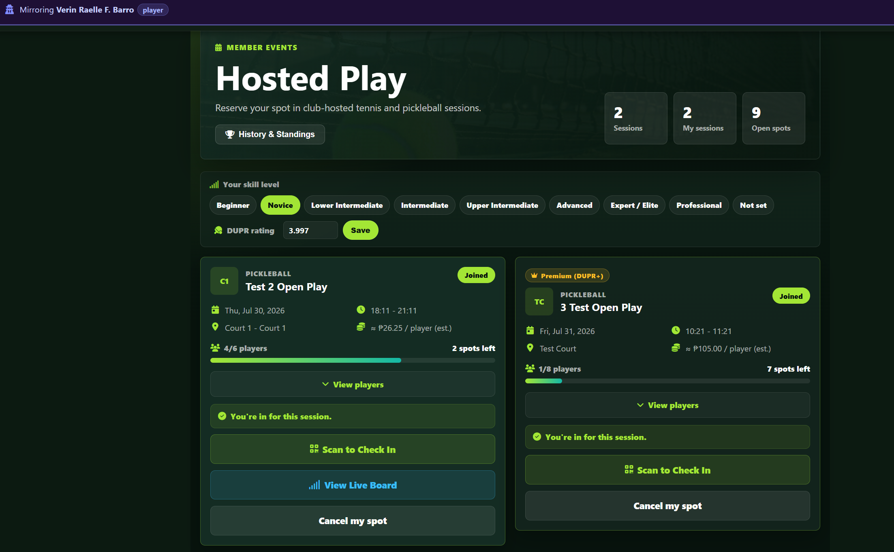

# DUPR Feature Report

Screenshots from SheServes Tennis Club. Premium Event features use the "3 Test Open Play" session; everything else uses "Test 2 Open Play".

## 1. Premium Event (DUPR+ gating) for Hosted Play

Admins can mark a Hosted Play session as a Premium Event (DUPR+ only) — shown here on "3 Test Open Play"'s Play Settings step, toggle switched on. Only players whose linked DUPR account has an active DUPR+ subscription can register or participate — everyone else (unlinked players, non-DUPR+ players, guest walk-ins) is blocked with a clear message, both in the app and on the public booking page.

## 2. Delete function for Recorded Games

Admins can delete a recorded game from the Queue Management page (trash icon on each row). If the game was already submitted to DUPR (see the "DUPR: Submitted" chip), deleting it also retracts it from DUPR so ratings recalculate correctly — no orphaned matches left counting toward a player's rating.

## 3. DUPR rating on player dashboard

Linked players see their DUPR rating right on their dashboard, under the greeting — here, Ysabelle's "DUPR 3.552".

## 4. DUPR "link your account" prompt on player dashboard

Players who haven't linked DUPR yet (on a club where DUPR is enabled) see a prompt in the same spot — here, Joshua sees "Link your DUPR account" instead of a rating, since he isn't linked yet. Tapping it goes straight to Profile → Linked Accounts.

## 5. DUPR rating in Attendance Check-In roster

Admins checking players in can see each player's DUPR rating right in the roster list (e.g. "She Serves — DUPR 3.448", "Verin Raelle F. Barro — DUPR 3.710").

## 6. Self-service DUPR Club ID for club admins

Club admins can now enter their own DUPR Club ID directly from their dashboard, right under the "DUPR Rating Sync" toggle — no more needing to send it to CourtGo support to enter manually. A hint links to dupr.com/clubs for finding the 10-digit ID.

## 7. Premium Event gating in action — blocked vs. allowed join

"3 Test Open Play" carries the amber "Premium (DUPR+)" badge. A player without a verified DUPR link gets a clear inline error on attempting to join: *"This is a Premium Event — link a verified DUPR account in your profile first."* — the join is rejected before any payment/registration step runs.

Verin Raelle F. Barro — whose DUPR account carries an active DUPR+ subscription — successfully joined the same "3 Test Open Play" session ("You're in for this session.", "Joined" badge). Her DUPR+ status wasn't picked up until she unlinked and relinked her DUPR account in Profile, since entitlements are only captured at the moment of linking (see note below).
