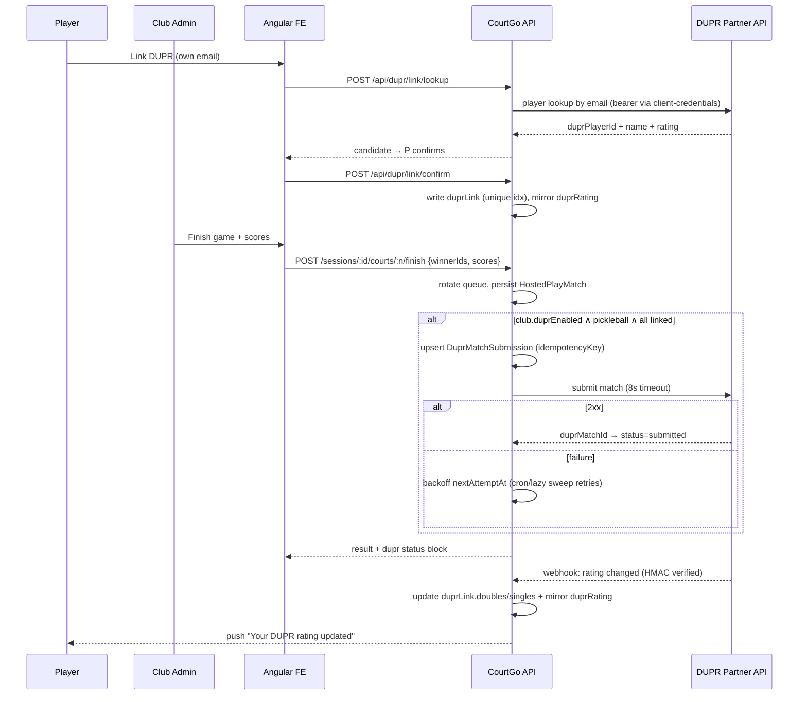

# CourtGo — DUPR + RecClub Integration: Design & Implementation Reference

> **STATUS: ON HOLD — awaiting DUPR Partner API credentials.**
> This document is the complete design reference so implementation can start the moment
> DUPR grants API access. No code has been written yet. External API facts were verified
> 2026-07-19; re-confirm details (webhook topics, endpoints) during DUPR partner onboarding.

## DUPR Onboarding Checklist (do while implementation is on hold)

1. Apply for Partner API access: [dupr.com/partners](https://www.dupr.com/partners) or support@mydupr.com — describe CourtGo (club platform; match submission + rating sync use case).
2. Sign the partner/licensing agreement; receive **UAT** `clientKey`/`clientSecret` (`uat.mydupr.com`), later production keys.
3. Optionally have clubs register at [dupr.com/clubs](https://www.dupr.com/clubs) for their 10-digit DUPR club ID (the superadmin panel already stores `duprClubId`).
4. During onboarding, confirm with DUPR: available **webhook topics** (rating change vs. match status), the client match-identifier field for idempotent submission, and rate limits.
5. When keys arrive: set `DUPR_CLIENT_KEY`, `DUPR_CLIENT_SECRET`, `DUPR_BASE_URL`, `DUPR_WEBHOOK_SECRET`, `DUPR_CRON_SECRET` in `.env`/Netlify → begin Phase A below.

## Context

CourtGo is a tennis/pickleball club platform with accounts, clubs, reservations, match management (Open Play, Tournaments, Hosted Play), rankings, and per-club feature toggles. Goal: let players link their DUPR account, let authorized users submit official match scores, push results to DUPR so they count toward official ratings, and sync updated DUPR ratings back into CourtGo. RecClub was requested as a second integration target.

Groundwork already exists (deliberately stubbed "Phase 0"): `User.duprRating` + `User.duprId` (self-reported, unverified), `Club.duprClubId` (+ superadmin PATCH), and a self-report rating input on the Hosted Play page.

## External API Reality (verified 2026-07-19)

**DUPR — official Partner API exists.**
- Auth: **client-credentials** (partner-level `clientKey` + `clientSecret` → bearer token, refresh on expiry). No per-user OAuth; player linking = DUPR-ID **lookup by email** + user confirmation.
- Capabilities: player lookup/ratings/history, rating subscriptions, match create (single/batch)/update/delete, club member ratings, **webhooks** (topic subscriptions, e.g. rating changes), events CRUD.
- Environments: UAT `https://uat.mydupr.com/api`, Prod `https://api.dupr.com/api`. Docs: events.mydupr.com/docs, backend.mydupr.com/swagger-ui.
- **Access is not self-serve**: requires a partner agreement. DUPR only accepts matches where **all players are DUPR-linked**, and DUPR is **pickleball-only**.

**RecClub (Reclub) — no public/developer API.** Its own DUPR integration is club-to-club (manual form: play.reclub.co/DUPR_Club_Form; Reclub staff link the clubs); the platform is mobile-only.

**Decision: integrate directly with DUPR; treat DUPR as the interchange hub for Reclub.** Reclub already pulls ratings *from* DUPR, so every match CourtGo submits to DUPR automatically updates the rating players see in Reclub — no Reclub code needed. Optional cosmetic extra: a free-text Reclub profile URL on the CourtGo profile. Deeper Reclub integration would be a business-development conversation with Reclub, not an engineering task today.

## Scope Decisions (confirmed with product owner, 2026-07-19)

1. **Match source: Hosted Play** (pickleball sessions only). Hosted Play currently persists **no per-game match records or scores** — the queue engine only tracks `winnerIds` for rotation — so this plan adds per-game score capture + a persisted match record.
2. **Submitters: club admins only** (matches the existing admin-only finish-game endpoint; lowest dispute risk).
3. **No DUPR partner credentials yet** — build everything behind config + club toggle; all DUPR code **no-ops when env vars are unset** (existing `backend/utils/push.js` discipline).

## Architecture Overview

```
Angular (profile link UI, score entry, status chips)
   │  /api/dupr/*, /api/hosted-play/*
   ▼
Express backend
   ├─ backend/utils/dupr.js        ← DUPR HTTP client (token cache, no-op unconfigured)
   ├─ backend/utils/duprSync.js    ← enqueue/submit/retry/state-machine helpers
   ├─ backend/routes/dupr.routes.js← link, submissions, dispute, webhook, cron sweep
   ├─ hosted-play finish hook      ← persists HostedPlayMatch, enqueues DUPR submission
   └─ Mongo: User.duprLink, Club.duprEnabled, HostedPlayMatch, DuprMatchSubmission
   ▲
DUPR Partner API (UAT/prod) ── webhooks ──► POST /api/dupr/webhook (HMAC-verified)
```

Serverless constraint (serverless-http/Netlify, no cron/bull/agenda): all DUPR calls happen **inline before the HTTP response** (8s AbortController timeout, never fails the parent request) with retries driven by (a) an external-cron-hit endpoint and (b) opportunistic lazy sweeps — same philosophy as `backend/utils/financeReportBilling.js`.

## Database Changes

**`backend/models/User.js`** — keep existing `duprRating`/`duprId` as unverified fallback; add:

```js
duprLink: {
  duprPlayerId: String,  email: String,  fullName: String,
  verified: Boolean, linkedAt: Date,
  doubles: Number, singles: Number, lastSyncedAt: Date,
},
reclubProfileUrl: { type: String, default: null },   // cosmetic, optional
```

Plus a unique sparse index on `duprLink.duprPlayerId` (one DUPR profile per CourtGo account).

**Precedence rule:** every successful sync also mirrors the doubles rating → `duprRating` and ID → `duprId`, so all existing display paths (hosted-play skill bands, profile, admin lists) show the verified number with zero rework. While `duprLink.verified`, the PUT profile handler (`backend/routes/users.routes.js:327-363`) rejects manual `duprRating`/`duprId` edits with 409; unlink keeps the last value as fallback.

**`backend/models/Club.js`** — add `duprEnabled: { type: Boolean, default: false }` beside `duprClubId`.

**`backend/models/HostedPlayMatch.js` (new)** — persisted per finished game:

```js
{ sessionId→HostedPlay, clubId, courtNumber,
  team1: [participant/user refs], team2: [...],      // teams from courtSlot pairing
  team1Score: Number|null, team2Score: Number|null,  // null = winner-only game
  winnerTeam: 1|2|null, finishedAt: Date, recordedBy→User }
```

**`backend/models/DuprMatchSubmission.js` (new)** — the audit/state record:

```js
{ clubId, source: {enum:['hosted_play']},            // extensible to open_play/tournament
  sourceMatchId (→HostedPlayMatch),
  idempotencyKey: `courtgo:hosted_play:${sourceMatchId}`,  // also sent to DUPR as client identifier
  players: [{ userId, duprPlayerId }], sport: 'pickleball',
  team1Score, team2Score, matchDate,
  status: enum ['pending_submission','submitted','accepted','rejected','disputed','failed'],
  duprMatchId, attempts, nextAttemptAt, lastError, errorLog: [{at,httpStatus,message}],
  submittedBy, dispute: { reason, raisedBy, raisedAt, resolvedAt } }
// unique index { source, sourceMatchId }  ← DB-level duplicate protection
```

### Submission state machine

```
                 ┌────────────── retry (sweep/manual) ─────────────┐
                 ▼                                                 │
pending_submission ──2xx──► submitted ──webhook/poll──► accepted   │
      │                        │                           │       │
      │ non-retryable 4xx      │ DUPR rejects              │       │
      │ or attempts ≥ 5 ──► failed                         │       │
      │                        ▼                           │       │
      │                     rejected ──admin corrects──┐   │       │
      └── admin dispute (any post-submit state) ──► disputed◄──────┘
                          resolve: DUPR delete + corrected scores
                                   └──► pending_submission (attempts reset)
```

Transitions enforced by one `canTransition(from, to)` helper; illegal moves → 409.

## Backend Workflow

**1. `backend/utils/dupr.js` (new, modeled on `utils/push.js`):** lazy env read; `isDuprConfigured()`; module-scope token cache `{token, expiresAt}` (survives warm serverless invocations); `duprFetch()` wrapper (bearer, JSON, 8s AbortController, returns `{ok,status,data,error}`, never throws into routes); ops: `lookupPlayerByEmail`, `getPlayerRating`, `submitMatch`, `updateMatch`, `deleteMatch`, `verifyWebhookSignature` (HMAC-SHA256 + `crypto.timingSafeEqual`).

**2. Score capture — hook the Hosted Play finish-game flow** (`backend/routes/hosted-play.routes.js:1151`, `POST /sessions/:id/courts/:n/finish`, already `auth, admin`):
- Accept optional `team1Score`/`team2Score` alongside `winnerIds`; derive teams from court slots; persist `HostedPlayMatch` for every finished game (scores null when not entered). Queue-engine rotation logic untouched.
- New `PATCH /api/hosted-play/matches/:matchId/score` (`auth, admin`) to add/correct scores after the fact (score-later workflow, and the dispute-resolution write path).
- After a `HostedPlayMatch` has scores: if `club.duprEnabled && session.sport === 'pickleball' && all players duprLink.verified` → `duprSync.enqueueAndSubmit(...)` (upsert `DuprMatchSubmission`, inline submit attempt, try/catch — never fails the response). Response gains `dupr: { eligible, unlinkedPlayerIds, submission: {status, lastError} }`.
- Score corrections on an already-submitted match: `updateMatch` on DUPR (fallback delete+recreate), status back to `submitted`.

**3. Retry strategy (`backend/utils/duprSync.js`):** `attemptDuprSubmit` — retryable failure (network/5xx/429) → `nextAttemptAt = now + 2^attempts min`, `failed` at 5 attempts; non-retryable 4xx → `failed` immediately. `processPendingSubmissions(limit)` — atomically claims due records (`findOneAndUpdate` pushing `nextAttemptAt` forward first → safe under concurrent invocations); also polls stale `submitted` records to advance to `accepted` if webhooks were missed. Triggered by: `POST /api/dupr/tasks/process` (external cron / Netlify scheduled function, `x-cron-secret` header) + opportunistic fire-and-forget sweep on `GET /api/dupr/status`/`submissions` (throttled to 1 run / 5 min per warm container).

**4. Webhook receiver:** one-line change in `backend/app.js` — `express.json({ verify: (req,_res,buf) => { req.rawBody = buf; } })` — then `POST /api/dupr/webhook`: verify HMAC (401 mismatch, 503 unconfigured); rating-change events → update `duprLink.*` + mirror `duprRating` (+ optional `sendPushToUser` "Your DUPR rating updated"); match-status events (if topic available — confirm during onboarding) → `submitted → accepted/rejected` (+ push to club admins on reject); respond 200 fast; idempotent (absolute sets, no increments).

## API Endpoints (all new, `backend/routes/dupr.routes.js`, mounted `/api/dupr`)

| Method | Path | Auth | Purpose |
|---|---|---|---|
| GET | `/api/dupr/status` | auth | `{configured, clubEnabled, myLink}` — drives all conditional UI |
| POST | `/api/dupr/link/lookup` | auth | `{email}` → DUPR candidate `{duprPlayerId, fullName, ratings}`; 404 if none |
| POST | `/api/dupr/link/confirm` | auth | Server re-validates lookup, writes `duprLink`, mirrors rating; 409 duplicate claim |
| DELETE | `/api/dupr/link` | auth | Unlink self; keep last rating as fallback |
| POST | `/api/dupr/refresh-rating` | auth | Manual pull of latest rating (admin may pass `userId` for same-club member) |
| GET | `/api/dupr/submissions?sessionId=` | auth, admin | Submission statuses for the session UI |
| POST | `/api/dupr/submissions/:id/resubmit` | auth, admin | Manual retry of failed/rejected (resets attempts) |
| POST | `/api/dupr/submissions/:id/dispute` | auth, admin | `{reason}` → `disputed` (freezes retries) |
| POST | `/api/dupr/submissions/:id/resolve` | auth, admin | Corrected scores → DUPR delete/update → resubmit |
| POST | `/api/dupr/webhook` | HMAC sig | DUPR event receiver |
| POST | `/api/dupr/tasks/process` | x-cron-secret | Retry/poll sweep trigger |

Plus in `backend/routes/clubs.routes.js` (cloning the `hostedPlayEnabled` pair): `PATCH /api/clubs/:id/dupr-addon` (superadmin), `PATCH /api/clubs/me/dupr-addon` (admin self-service; 409 if platform unconfigured).

## Authentication Model

- **CourtGo↔DUPR:** partner-level client-credentials; `clientKey`/`clientSecret` in root `.env` (`DUPR_CLIENT_KEY`, `DUPR_CLIENT_SECRET`, `DUPR_BASE_URL`, `DUPR_WEBHOOK_SECRET`, `DUPR_CRON_SECRET`) + Netlify env. **No at-rest encryption needed** — these are platform secrets identical in sensitivity to the existing `JWT_SECRET`/`VAPID_PRIVATE_KEY` env vars; no per-user tokens are ever stored (only DUPR player ID/email/rating — profile data, not credentials).
- **User↔CourtGo:** existing JWT + `auth`/`admin`/`superadmin` middleware; no changes.
- **Linking trust rule:** players may only look up **their own CourtGo account email**; admins/superadmins may look up other emails (org-assisted linking). Prevents claiming a stranger's DUPR profile; the unique index prevents double-claims.

## User Flows

**Link (player):** Profile → Linked Accounts → "Find my DUPR account" (email prefilled, locked) → confirm card shows DUPR name + rating → "Yes, link" → verified badge + synced rating. Unlink anytime.

**Score → DUPR (admin):** Finish game on queue board → winner picker + new optional score inputs → match persisted → if eligible, auto-submitted to DUPR → status chip (Pending/Submitted/Accepted/Rejected/Failed/Disputed) with Retry / Dispute / Resolve actions. Unlinked players shown as chips: "Recorded in CourtGo only — 2 players unlinked."

**Rating sync-back:** DUPR webhook (or poll/manual refresh) → `duprLink` + mirrored `duprRating` updated → optional push notification.

### Sequence diagram



## Frontend Changes

- **`frontend/src/app/core/services/dupr.service.ts` (new):** standard pattern (`${environment.apiUrl}/dupr/...`; JWT + club interceptors apply). Methods mirror the endpoint table; export `DuprLinkState`/`DuprSubmission` types.
- **`features/player/profile/profile-edit.component.ts`:** "Linked Accounts" section card — lookup/confirm/linked-badge/refresh/unlink states (signals); optional Reclub profile URL field; hidden when `!configured || !clubEnabled`.
- **`features/player/hosted-play/hosted-play.component.ts`:** when `duprLink.verified`, replace the self-report rating input with read-only "✓ Verified via DUPR" display.
- **Hosted Play queue board (admin):** finish-game dialog gains optional per-team score inputs; session view listing recorded `HostedPlayMatch`es with score edit + DUPR status chips and Retry/Dispute/Resolve actions.
- **`core/services/club.service.ts`:** `duprEnabled` on `Club` + `patchDuprAddon`/`patchMyDuprAddon` (beside existing `patchDuprClubId`).
- **`features/admin/dashboard/dashboard.component.ts`:** DUPR toggle card (cloned `hpq-switch` pattern), disabled + tooltip when platform unconfigured. **`features/admin/clubs/clubs.component.ts`:** enable toggle beside the existing `duprClubId` field.

## Edge Cases

- **Unlinked players:** game finishes, rotation and internal flow unaffected; no submission created; `unlinkedPlayerIds` surfaced so the admin can nudge players. Never hard-block score entry.
- **Duplicates:** unique `{source, sourceMatchId}` index + deterministic `idempotencyKey` sent to DUPR (dedupes on both sides even under double-taps/retries/replays).
- **Disputes:** `disputed` freezes retries; resolve = delete on DUPR → corrected scores → resubmit through the same record; full audit trail in `dispute` + `errorLog`.
- **Failed/delayed calls:** inline attempt with timeout → exponential backoff (`nextAttemptAt`, cap 5) → cron + lazy sweep → manual resubmit; stale-`submitted` poller covers missed webhooks; everything no-ops gracefully when DUPR is down.

## Security Considerations

- Webhook: HMAC-SHA256 over raw body, `timingSafeEqual`, reject unsigned/mismatched; the endpoint does nothing else.
- Linking: own-email-only for players; unique DUPR-ID index; server re-validates the lookup on confirm (a client can't forge a duprPlayerId).
- Secrets: env-vars only, never in Mongo/frontend; cron endpoint gated by a shared secret header.
- Authorization: every submission route is `auth, admin` and club-scoped; webhook and cron are the only non-JWT paths, each with its own credential.
- PII: only DUPR ID, email, name, ratings stored — disclose in the privacy policy; unlinking clears `duprLink`.

## Limitations & Licensing

- **DUPR partner agreement is a prerequisite** — commercial terms set by DUPR; apply early (it gates the whole timeline). Build against UAT first; follow DUPR branding/usage guidelines (they publish a branded-API partner document).
- DUPR is **pickleball-only** — tennis/badminton/etc. sessions never submit; matches need **all players linked**; results generally count only from the integration date forward.
- **Reclub has no API** — integration is indirect via DUPR ratings; per-club Reclub↔DUPR sync is something club owners set up with Reclub directly (their form), outside CourtGo.
- No daemons on this serverless deploy — retry latency is bounded by cron cadence (≈10 min), acceptable for rating workflows.
- Pre-existing issue (out of scope, flagged): re-scoring a completed Open Play match double-applies internal Elo.

## Implementation Order & File List

**Phase A — foundation (invisible, safe to merge):** env vars; `Club.duprEnabled` + 2 PATCH routes (`clubs.routes.js`); `User.duprLink` + PUT-handler guard (`User.js`, `users.routes.js`); `utils/dupr.js`; `models/DuprMatchSubmission.js`; `models/HostedPlayMatch.js`.

**Phase B — linking:** `routes/dupr.routes.js` (status/link/refresh) + mount in `app.js`; `core/services/dupr.service.ts`; profile-edit Linked Accounts UI; hosted-play read-only rating swap.

**Phase C — scores → DUPR:** finish-game score capture + `HostedPlayMatch` persistence + `utils/duprSync.js` hook (`hosted-play.routes.js`); match-score PATCH; submissions/dispute/resubmit/resolve endpoints; admin queue-board score UI + status chips.

**Phase D — sync-back & ops:** raw-body verify in `app.js`; webhook handler; cron sweep endpoint + Netlify scheduled function (or external cron); push notifications; club toggle UI cards.

## Verification Plan

1. **Unconfigured regression (no creds needed):** with `DUPR_*` unset — full hosted-play session end-to-end: no DUPR UI anywhere, finish-game unchanged, `HostedPlayMatch` records persist, no errors in logs.
2. **Mock-DUPR pass:** point `DUPR_BASE_URL` at a local stub Express server to drive: link happy path / lookup miss / duplicate claim (409) / unlink; all-linked pickleball game → `submitted→accepted`; one unlinked → skipped with correct chips; tennis session → never submits; same-match re-finish → single submission doc; kill stub → backoff → `failed` at 5 → manual resubmit; webhook with valid/tampered/replayed signature; wrong cron secret → 401.
3. **UAT pass (once DUPR grants credentials):** repeat #2 against `uat.mydupr.com`, register the webhook URL, verify a real rating round-trips into `duprRating` and hosted-play skill banding.
4. **Frontend:** `npm run build` in `frontend/`; manual two-browser check (player links + admin scores).

## Reference Links

- DUPR partner program: https://www.dupr.com/partners
- DUPR API docs: https://events.mydupr.com/docs · https://backend.mydupr.com/swagger-ui/index.html
- DUPR club resources: https://www.dupr.com/club-resources
- Reclub FAQ (DUPR connection, no public API): https://pickleball.reclub.co/faq
- Community partner-API client (endpoint/auth reference): https://github.com/Info-Esportes/dupr-partner-api
