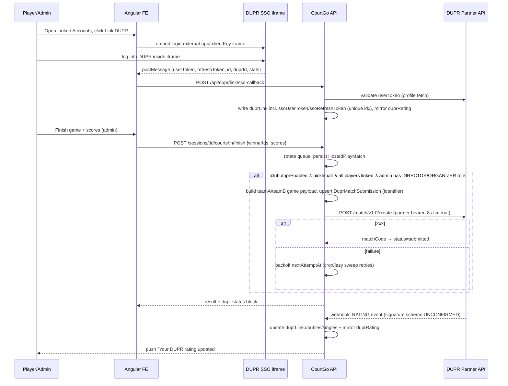

# CourtGo — DUPR + RecClub Integration: Design & Implementation Reference

> **STATUS: Phases A-D shipped and verified live against UAT.**
> (2026-07-27, commits through `b7612ea`, all unpushed.) Linking (SSO iframe), Hosted Play
> score submission (with club-role gating), rating sync-back via webhooks, the retry-sweep
> endpoint, and both the admin-facing and superadmin-facing DUPR toggle switches all work
> against real UAT/real browser testing — see the per-phase notes under Implementation
> Order for exactly what was tested and what bugs live testing caught. Only remaining gap:
> actually registering a real webhook URL, which needs a public HTTPS deploy (untestable
> from this local dev environment), and wiring an external cron/Netlify scheduled function
> to call the retry-sweep endpoint on a timer. Two of DUPR's 5 production-review checklist
> items are still unaddressed: rating-visibility-via-webhook is code-complete but
> unregistered, and User Gating hasn't been started (applicability to our Hosted-Play-only
> scope is still an open question for `tech@mydupr.com`).
>
> Much of this design was corrected mid-implementation: the 2026-07-19 draft guessed at
> DUPR's auth/linking model before partner access existed, and even GitBook's own docs
> (fetched 2026-07-27) turned out wrong twice on endpoint paths/shapes — the reliable
> source was always the raw OpenAPI spec (`{base}/v3/api-docs`), parsed directly with
> `node`, not WebFetch's summary of it (which kept truncating) or GitBook's prose.

## DUPR Onboarding Checklist

1. ~~Apply for Partner API access~~ **Done** — agreement received 2026-07-24, signed.
2. ~~Sign the partner/licensing agreement~~ **Done.** UAT `clientKey`/`clientSecret`/`clientId` received 2026-07-27, live in root `.env`. Auth flow verified working against `uat.mydupr.com` (see Auth Model below).
3. Optionally have clubs register at [dupr.com/clubs](https://www.dupr.com/clubs) for their 10-digit DUPR club ID (the superadmin panel already stores `duprClubId`).
4. **Open questions to raise with `tech@mydupr.com` before Phase C/D:**
   - Webhook signature verification — DUPR's docs describe no signing scheme for the `RATING` webhook envelope (`{clientId, event, message}`); confirm there really is none before trusting an unsigned HTTPS POST.
   - Whether the "User Gating" production-review requirement (BASIC_L1/PREMIUM_L1/VERIFIED_L1 entitlements) applies given CourtGo's scope is Hosted Play matches only — no DUPR+ tournaments or merchandise pricing today.
   - Exact request/response schema for `POST /auth/{version}/token` beyond what's been verified live (see Auth Model) — the OpenAPI spec at `uat.mydupr.com/api/v3/api-docs` truncates before full detail.
5. When ready for the production review: email `tech@mydupr.com` with a live platform URL, test credentials, and a compliance summary covering all 5 checklist items (SSO login, rating visibility/webhooks, user gating, match management, club integration) — ~10 business day turnaround.

## Context

CourtGo is a tennis/pickleball club platform with accounts, clubs, reservations, match management (Open Play, Tournaments, Hosted Play), rankings, and per-club feature toggles. Goal: let players link their DUPR account, let authorized users submit official match scores, push results to DUPR so they count toward official ratings, and sync updated DUPR ratings back into CourtGo. RecClub was requested as a second integration target.

Groundwork already exists (deliberately stubbed "Phase 0"): `User.duprRating` + `User.duprId` (self-reported, unverified), `Club.duprClubId` (+ superadmin PATCH), and a self-report rating input on the Hosted Play page. Additionally, **`backend/models/HostedPlayMatch.js` is fully built** (per-game records with team snapshots, nullable scores, `winnerTeam`/`winnerSource`, score-correction endpoint) — this was built as a standalone Hosted Play feature, zero DUPR code, and satisfies the score-capture prerequisite Phase C originally called for.

## External API Reality (originally verified 2026-07-19, corrected 2026-07-27 against dupr.gitbook.io/dupr-raas)

**DUPR — official "RaaS" (Ratings as a Service) Partner API exists.** The 2026-07-19 design below was wrong about the auth/linking model — corrected version:

- **Two separate auth mechanisms, not one:**
  1. **Partner-level, client-credentials** (`clientKey`+`clientSecret` → bearer token) — used for match submission/management calls. **Confirmed live 2026-07-27**: `POST {base}/auth/v1.0/token` with `base64(clientKey:clientSecret)` in an `x-authorization` header (not a JSON body) → `{status:"SUCCESS", result:{token, expiry}}`; `expiry` is an absolute ISO timestamp; token valid **1 hour**.
  2. **Per-user SSO** — mandatory for account linking; there is no partner-token "lookup player by email" endpoint. Partners embed a login iframe (`https://uat.dupr.gg/login-external-app/:clientKey` UAT / `https://dashboard.dupr.com/login-external-app/:clientKey` prod, `:clientKey` Base64-encoded) and listen for a `postMessage` carrying `userToken`/`refreshToken`/`id`/`duprId`/`stats`. UAT tokens: 7-day access / 30-day refresh. Prod: 30-day / 90-day. Without completed SSO, DUPR 403s on profile/match-history reads (match *submission* for unlinked players is still allowed per the docs, though Match Upload's "all players require BASIC_L1" note is in tension with that — needs confirming with DUPR).
- **Match submission — corrected again 2026-07-27, this time against the real OpenAPI spec** (`uat.mydupr.com/api/v3/api-docs`, fetched and parsed directly with `node` since WebFetch's summarizer kept truncating before the schema; GitBook's own paraphrase of these endpoints turned out wrong on path, casing, and shape). Real endpoints: `POST /match/{version}/create`, `POST /match/{version}/batch` (bulk), `POST /match/{version}/update`, `DELETE /match/{version}/delete` (`version` defaults `v1.0`) — **not** `/Match/saveMatch` etc. Payload (`ExternalMatchRequest`): `identifier` (our idempotency key — **must be universally unique forever**, can't be reused even after delete), `matchDate` (`yyyy-MM-dd`, today-or-past +24h grace), `location`, `format` (`SINGLES`|`DOUBLES`), `matchType` (`SIDEOUT`|`RALLY`), **`teamA`/`teamB` are flat objects** `{player1, player2, game1..game5}` (DUPR IDs + up to 5 game scores directly on the team — not a nested players/games array as GitBook implied), `event` (required), `bracket`, **`clubId` is an integer** (not a string), `matchSource` (`PARTNER`|`CLUB`|`LEAGUE`|`DUPR` — omit `clubId` for `PARTNER`), `matchCompletionType` (`COMPLETED` default/rated; `TIE`/`FORFEIT`/`WITHDRAWAL`/`RETIREMENT`/`UNKNOWN` are non-rated, bypass ELO, need `UNCALCULATED_MATCH::ADD` permission), `extras`. Rated matches need a clear per-game winner with the winner scoring ≥6; all players need `BASIC_L1`; no duplicate players across teams. Success: `{status:"SUCCESS", result:{identifier, matchCode, hashedMatchCode}}` — **store `matchCode`**, required for update/delete. Update requires `matchId` (`Number(matchCode)`); `matchCompletionType` is immutable on update (delete+recreate to change it). Delete requires both `matchCode` and the original `identifier`.
- **Club match submission requires the *submitting user's own* DUPR role**, not a CourtGo role — confirmed via `GET /user/{version}/{id}/clubs` (`id` = DUPR ID), which returns `{membership: [{clubId, clubName, role}]}` (role: DIRECTOR/ORGANIZER/PLAYER). **This endpoint uses the PARTNER bearer token, not the admin's own SSO token** — simpler than originally assumed; no per-user token round-trip needed for the role check itself. Only DIRECTOR/ORGANIZER may submit club-sourced matches. Verified live: a real UAT test account (`player1@courtgo.com`) holds DIRECTOR on DUPR's own UAT "CourtGo Club".
- **Webhooks — endpoints and payload shape confirmed 2026-07-27 against the real OpenAPI spec + a live unauthenticated call to `GET /v1.0/webhook/schema/RATING`** (not GitBook's prose, which was already wrong twice this session for other endpoints): `POST /{version}/webhook` registers `{webhookUrl, topics:["RATING"]}` — **only one webhook registration per client, ever**; registering synchronously POSTs a `REGISTRATION`-event handshake to `webhookUrl` and requires `200` back, so this can only be exercised against a real public HTTPS deploy, never localhost. `POST /user/{version}/subscribe/webhook-event` (`{duprIds, topic:"RATING"}`) subscribes players — fires an immediate `RATING_SEED` event per player (current snapshot; `rating`/`metrics` null if never played a rated match); `DELETE` unsubscribes. Envelope: `{clientId, event, message}`; `message` (`RatingUpdate`): `duprId, name, token, timestamp, rating:{singles, doubles, singlesReliability, doublesReliability, matchId, ...halfLife/provisional fields}, metrics:{statistics, subscores}` — `rating.singles`/`rating.doubles` are **strings** (reuse the `parseDuprRating()` "NR" normalizer from Phase B). **CONFIRMED no signature/HMAC scheme exists anywhere in the spec** (grepped the entire raw JSON for "signature"/"hmac"/"secret" — nothing) — the unexplained `message.token` field's purpose is unknown; worth asking DUPR support rather than assuming it's a verification token. Authenticity in practice rests on the URL being known only to us and DUPR, plus checking `clientId` matches ours.
- **User Gating**: entitlements `BASIC_L1` (required for any platform action), `PREMIUM_L1` (DUPR+ tournaments), `VERIFIED_L1` (identity-verification-gated resources), queried via the Subscriptions Controller after SSO, cacheable 24h. One of DUPR's 5 mandatory production-review items — applicability to CourtGo's Hosted-Play-only scope is unconfirmed (see onboarding checklist).
- Environments: UAT `https://uat.mydupr.com/api` (dashboard `uat.dupr.gg`), Prod `https://api.dupr.com/api` (dashboard `dashboard.dupr.com`). Full docs: `dupr.gitbook.io/dupr-raas`.
- **Access is not self-serve**: requires a signed partner agreement + a manual production-review pass (see onboarding checklist item 5) before production keys are issued — UAT access alone doesn't imply compliance. DUPR is **pickleball-only**.

**RecClub (Reclub) — no public/developer API.** Its own DUPR integration is club-to-club (manual form: play.reclub.co/DUPR_Club_Form; Reclub staff link the clubs); the platform is mobile-only.

**Decision: integrate directly with DUPR; treat DUPR as the interchange hub for Reclub.** Reclub already pulls ratings *from* DUPR, so every match CourtGo submits to DUPR automatically updates the rating players see in Reclub — no Reclub code needed. Optional cosmetic extra: a free-text Reclub profile URL on the CourtGo profile. Deeper Reclub integration would be a business-development conversation with Reclub, not an engineering task today.

## Scope Decisions (confirmed with product owner, 2026-07-19)

1. **Match source: Hosted Play** (pickleball sessions only). Hosted Play currently persists **no per-game match records or scores** — the queue engine only tracks `winnerIds` for rotation — so this plan adds per-game score capture + a persisted match record. ~~Currently persists no scores~~ — superseded, see Context: `HostedPlayMatch` now fully built.
2. **Submitters: club admins only** at the CourtGo layer (matches the existing admin-only finish-game endpoint) — **but DUPR additionally requires the submitting admin to personally hold a DUPR DIRECTOR/ORGANIZER role on that club** (discovered 2026-07-27, see External API Reality). This means club admins need their own DUPR SSO link + role check, not just player-side linking as originally scoped. Practical fallback if an admin isn't DUPR-linked/role-qualified: the match still records in `HostedPlayMatch`/CourtGo internally, just skips DUPR submission (same graceful-skip pattern as unlinked players).
3. **DUPR partner credentials arrived 2026-07-27** — still build behind config + club toggle; all DUPR code **no-ops when env vars are unset** (existing `backend/utils/push.js` discipline), since production keys/full compliance are still pending.

## Architecture Overview

```
Angular (SSO iframe + postMessage listener, score entry, status chips)
   │  /api/dupr/*, /api/hosted-play/*        ▲
   ▼                                          │ postMessage {userToken, refreshToken, duprId, ...}
Express backend                    DUPR SSO iframe (login-external-app/:clientKey)
   ├─ backend/utils/dupr.js        ← partner-token HTTP client (token cache, no-op unconfigured)
   ├─ backend/utils/duprSync.js    ← enqueue/submit/retry/state-machine helpers
   ├─ backend/routes/dupr.routes.js← sso-callback, submissions, dispute, webhook, cron sweep
   ├─ hosted-play finish hook      ← persists HostedPlayMatch, enqueues DUPR submission
   └─ Mongo: User.duprLink (incl. ssoUserToken/ssoRefreshToken), Club.duprEnabled, HostedPlayMatch, DuprMatchSubmission
   ▲
DUPR Partner API (UAT/prod) ── webhooks ──► POST /api/dupr/webhook (signature scheme UNCONFIRMED)
```

Serverless constraint (serverless-http/Netlify, no cron/bull/agenda): all DUPR calls happen **inline before the HTTP response** (8s AbortController timeout, never fails the parent request) with retries driven by (a) an external-cron-hit endpoint and (b) opportunistic lazy sweeps — same philosophy as `backend/utils/financeReportBilling.js`.

## Database Changes

**`backend/models/User.js`** — keep existing `duprRating`/`duprId` as unverified fallback; **shipped 2026-07-27** (commit `8375c94`):

```js
duprLink: {
  duprPlayerId: String,  email: String,  fullName: String,
  verified: Boolean, linkedAt: Date,
  doubles: Number, singles: Number, lastSyncedAt: Date,
},
```

Plus a unique sparse index on `duprLink.duprPlayerId` (one DUPR profile per CourtGo account).

**Not yet added — needed once the SSO discovery (2026-07-27) is implemented in Phase B:** the shipped `duprLink` shape above has no home for the per-user SSO tokens the iframe/postMessage flow returns. Add:

```js
duprLink: {
  // ...existing fields above...
  ssoUserToken: String,        // treat as a live credential, not profile data
  ssoRefreshToken: String,
  ssoTokenExpiresAt: Date,
  ssoRefreshExpiresAt: Date,
}
```

This changes the Security Considerations note below ("no per-user tokens are ever stored") — that was true of the original email-lookup design but is **no longer true**: `ssoUserToken`/`ssoRefreshToken` are real per-user DUPR credentials and need the same at-rest care as any other session token (consider encrypting at rest, unlike the plain profile fields above).

`reclubProfileUrl: { type: String, default: null }` (cosmetic, optional) is also not yet added.

**Precedence rule:** every successful sync also mirrors the doubles rating → `duprRating` and ID → `duprId`, so all existing display paths (hosted-play skill bands, profile, admin lists) show the verified number with zero rework. While `duprLink.verified`, the PUT profile handler (`backend/routes/users.routes.js:327-363`) rejects manual `duprRating`/`duprId` edits with 409; unlink keeps the last value as fallback.

**`backend/models/Club.js`** — `duprEnabled: { type: Boolean, default: false }` beside `duprClubId`. **Shipped 2026-07-27.**

**`backend/models/HostedPlayMatch.js`** — already fully built (predates this plan, standalone Hosted Play feature): `sessionId`, `clubId`, `courtNumber`, `team1`/`team2` (participant snapshots), `team1Score`/`team2Score` (nullable), `winnerTeam`, `winnerSource`, `finishedAt`, `recordedBy`. No changes needed for DUPR.

**`backend/models/DuprMatchSubmission.js`** — **shipped 2026-07-27** (commit `8375c94`) with the fields originally planned (`clubId`, `source`, `sourceMatchId`, `idempotencyKey`, `players[{userId,duprPlayerId}]`, `sport`, `team1Score`/`team2Score`, `matchDate`, `status`, `duprMatchId`, `attempts`, `nextAttemptAt`, `lastError`, `errorLog`, `submittedBy`, `dispute`, unique index on `{source, sourceMatchId}`).

**Correction needed once Phase C actually builds the submission (2026-07-27 finding):** DUPR's real `saveMatch` payload doesn't take a flat `team1Score`/`team2Score` pair — it takes `teamA`/`teamB`, each with **1-5 games**, plus `format` (`SINGLES`/`DOUBLES`), `matchType` (`SIDEOUT`/`RALLY`), and `identifier` as the idempotency key (maps directly to `DuprMatchSubmission.idempotencyKey`). Since `HostedPlayMatch`/`DuprMatchSubmission` only ever store one score pair per finished game, the Phase C submission-builder will need to wrap that single pair as **one game** inside `teamA`/`teamB` game arrays — the stored schema doesn't need to change, just the payload-construction code in `duprSync.js`. `matchType` (SIDEOUT vs RALLY pickleball scoring) isn't captured anywhere in CourtGo today; needs a decision (likely a fixed default, or a new field, once confirmed which one Hosted Play actually plays).

### Submission state machine

```
                 ┌────────────── retry (sweep/manual) ─────────────┐
                 ▼                                                 │
pending_submission ──2xx──► submitted ──webhook/poll──► accepted   │
      │                        │                           │       │
      │ non-retryable 4xx      │ DUPR rejects              │       │
      │ or attempts ≥ 5 ──► failed                         │       │
      │                        ▼                           │       │
      │                     rejected ──admin corrects──┐   │       │
      └── admin dispute (any post-submit state) ──► disputed◄──────┘
                          resolve: DUPR delete + corrected scores
                                   └──► pending_submission (attempts reset)
```

Transitions enforced by one `canTransition(from, to)` helper; illegal moves → 409.

## Backend Workflow

**1. `backend/utils/dupr.js`** — **shipped 2026-07-27, fixed same day** (commits `8375c94`, `046eeb2`) after live-testing against UAT: `isDuprConfigured()`; module-scope token cache `{token, expiresAt}` keyed off DUPR's absolute `expiry` timestamp; `duprFetch()` wrapper (bearer, JSON, 8s AbortController, returns `{ok,status,data,error}`, never throws into routes) — confirmed working live (auth handshake succeeds; verified via a real `Match` endpoint 404 rather than a 401, proving the token is accepted). Ops now match DUPR's actual API: `submitMatch`, `submitMatchesInBulk`, `updateMatch`, `deleteMatch` (real paths: `/Match/saveMatch`, `/Match/saveMatchInBulk`, `/Match/updateMatch`, `/Match/deleteMatch`), `verifyWebhookSignature` (kept but flagged UNCONFIRMED — no documented DUPR signature scheme). **Dropped** `lookupPlayerByEmail`/`getPlayerRating` — those modeled the wrong (email-lookup) linking design; there's no partner-token endpoint for this, linking is SSO-only (see Auth Model).

**2. Score capture — ALREADY BUILT, hook it to DUPR.** `POST /sessions/:id/courts/:n/finish`, the `PATCH /api/hosted-play/matches/:matchId/score` correction endpoint, and `HostedPlayMatch` persistence (teams, nullable scores, winner derivation) all exist today and ship scores independent of DUPR. Remaining work, corrected for the real payload shape:
- After a `HostedPlayMatch` has scores: if `club.duprEnabled && session.sport === 'pickleball' && all players duprLink.verified` **AND the recording admin's own DUPR club role is DIRECTOR/ORGANIZER** (fetch via the admin's stored SSO `ssoUserToken` against Get Club Memberships, matched to `club.duprClubId`) → `duprSync.enqueueAndSubmit(...)`: build the `teamA`/`teamB` game-array payload from the single `team1Score`/`team2Score` pair (wrapped as one game), upsert `DuprMatchSubmission` (`idempotencyKey` → DUPR's `identifier`), inline submit attempt, try/catch — never fails the response. Response gains `dupr: { eligible, unlinkedPlayerIds, submission: {status, lastError} }`.
- Score corrections on an already-submitted match (existing `correctMatchScore` path in `hosted-play.routes.js`): `updateMatch` on DUPR, status back to `submitted`.

**3. Retry strategy (`backend/utils/duprSync.js`):** `attemptDuprSubmit` — retryable failure (network/5xx/429) → `nextAttemptAt = now + 2^attempts min`, `failed` at 5 attempts; non-retryable 4xx → `failed` immediately. `processPendingSubmissions(limit)` — atomically claims due records (`findOneAndUpdate` pushing `nextAttemptAt` forward first → safe under concurrent invocations); also polls stale `submitted` records to advance to `accepted` if webhooks were missed. Triggered by: `POST /api/dupr/tasks/process` (external cron / Netlify scheduled function, `x-cron-secret` header) + opportunistic fire-and-forget sweep on `GET /api/dupr/status`/`submissions` (throttled to 1 run / 5 min per warm container).

**4. Webhook receiver — SHIPPED 2026-07-27** (commit `f41aab2`): no raw-body/HMAC verification, since none of that is real (see above) — plain `express.json()` is fine. `POST /api/dupr/webhook`: checks `clientId` matches ours, looks up the user by `duprLink.duprPlayerId`, updates `duprLink.doubles`/`singles`/`lastSyncedAt` + mirrors `duprRating`, best-effort `sendPushToUser`. Verified live by POSTing a real-shaped `RATING` event at the running backend and confirming the DB update. **Match-status events are not a real DUPR concept** — there's no separate topic for match acceptance/rejection in the spec; `submitted`/`accepted`/`rejected` in `DuprMatchSubmission` currently only transition via the inline create/update response (Phase C), not a webhook. `utils/dupr.js` also gained `subscribeToRatingUpdates`/`unsubscribeFromRatingUpdates`, hooked into the Phase B link/unlink handlers so a linked player's rating populates immediately via the `RATING_SEED` seed event once a webhook is actually registered.

## API Endpoints (all new, `backend/routes/dupr.routes.js`, mounted `/api/dupr`)

| Method | Path | Auth | Purpose |
|---|---|---|---|
| GET | `/api/dupr/status` | auth | `{configured, clubEnabled, myLink}` — drives all conditional UI |
| POST | `/api/dupr/link/sso-callback` | auth | **Corrected 2026-07-27** (was `link/lookup`+`link/confirm`, email-lookup design — wrong). Frontend posts the `{userToken, refreshToken, id, duprId, stats}` payload it received from the SSO iframe's `postMessage`; server validates against DUPR (fetch profile with `userToken` before trusting it), writes `duprLink` incl. `ssoUserToken`/`ssoRefreshToken`, mirrors rating; 409 duplicate claim |
| DELETE | `/api/dupr/link` | auth | Unlink self; keep last rating as fallback |
| POST | `/api/dupr/refresh-rating` | auth | Manual pull of latest rating (admin may pass `userId` for same-club member) |
| GET | `/api/dupr/submissions?sessionId=` | auth, admin | Submission statuses for the session UI |
| POST | `/api/dupr/submissions/:id/resubmit` | auth, admin | Manual retry of failed/rejected (resets attempts) |
| POST | `/api/dupr/submissions/:id/dispute` | auth, admin | `{reason}` → `disputed` (freezes retries) |
| POST | `/api/dupr/submissions/:id/resolve` | auth, admin | Corrected scores → DUPR delete/update → resubmit |
| POST | `/api/dupr/webhook` | HMAC sig | DUPR event receiver |
| POST | `/api/dupr/tasks/process` | x-cron-secret | Retry/poll sweep trigger |

Plus in `backend/routes/clubs.routes.js` (cloning the `hostedPlayEnabled` pair): `PATCH /api/clubs/:id/dupr-addon` (superadmin), `PATCH /api/clubs/me/dupr-addon` (admin self-service; 409 if platform unconfigured).

## Authentication Model (rewritten 2026-07-27 — original design assumed a single client-credentials flow; DUPR actually has two)

- **CourtGo↔DUPR (partner-level, for match submission):** client-credentials; `clientKey`/`clientSecret` in root `.env` (`DUPR_CLIENT_KEY`, `DUPR_CLIENT_SECRET`, `DUPR_BASE_URL`, `DUPR_WEBHOOK_SECRET`, `DUPR_CRON_SECRET`) + Netlify env. **Confirmed live 2026-07-27**: `base64(clientKey:clientSecret)` in an `x-authorization` header → 1-hour bearer token. No at-rest encryption needed for these — platform secrets identical in sensitivity to `JWT_SECRET`/`VAPID_PRIVATE_KEY`.
- **User↔DUPR (per-user, mandatory for linking — NEW, not in the original design):** DUPR's SSO iframe (`login-external-app/:clientKey`) → `postMessage` with `userToken`/`refreshToken`/`id`/`duprId`/`stats`. These **are real per-user credentials and must be stored as such** (`User.duprLink.ssoUserToken`/`ssoRefreshToken` — see Database Changes) — the original design's claim that "no per-user tokens are ever stored" no longer holds. UAT tokens: 7-day access / 30-day refresh; prod: 30/90-day. Needs a refresh-before-expiry job or lazy-refresh-on-401 pattern; expired refresh token forces the user to re-run the SSO iframe.
- **Club-match submission gate (NEW):** DUPR checks the *submitting user's own* DUPR club role (DIRECTOR/ORGANIZER), fetched via that user's `ssoUserToken` against DUPR's "Get Club Memberships" endpoint — not a CourtGo-side permission. A club admin must personally complete SSO linking and hold that role on the matching `duprClubId`, or their submissions get rejected/skipped.
- **User↔CourtGo:** existing JWT + `auth`/`admin`/`superadmin` middleware; no changes.
- **Linking trust rule:** SSO login is inherently self-service (the iframe authenticates the DUPR account directly) — the old "players may only look up their own email" rule doesn't apply since there's no partner-token lookup step anymore. The unique index on `duprLink.duprPlayerId` still prevents one DUPR account being claimed by two CourtGo users.

## User Flows (link flow corrected 2026-07-27 — SSO iframe, not email lookup)

**Link (player or admin — both need it now):** Profile → Linked Accounts → embedded DUPR login iframe → user logs into DUPR inside the iframe → iframe posts `{userToken, refreshToken, id, duprId, stats}` to the parent window → frontend calls `POST /api/dupr/link/sso-callback` → verified badge + synced rating. Club admins additionally need this so DUPR can check their DIRECTOR/ORGANIZER club role at submission time. Unlink anytime.

**Score → DUPR (admin):** Finish game on queue board → winner picker + optional score inputs → match persisted → if eligible (all players linked **and** the recording admin holds the right DUPR club role) → auto-submitted to DUPR → status chip (Pending/Submitted/Accepted/Rejected/Failed/Disputed) with Retry/Dispute/Resolve actions. Ineligible cases shown as chips: "Recorded in CourtGo only — 2 players unlinked" or "— admin not DUPR-authorized for this club."

**Rating sync-back:** DUPR webhook (or poll/manual refresh) → `duprLink` + mirrored `duprRating` updated → optional push notification.

### Sequence diagram



## Frontend Changes

- **`frontend/src/app/core/services/dupr.service.ts` (new):** standard pattern (`${environment.apiUrl}/dupr/...`; JWT + club interceptors apply). Methods mirror the endpoint table; export `DuprLinkState`/`DuprSubmission` types.
- **`features/player/profile/profile-edit.component.ts`:** "Linked Accounts" section card — **corrected 2026-07-27**: embeds the DUPR SSO iframe (`<iframe>` pointed at `login-external-app/:clientKey`) rather than an email-lookup form; a `window.addEventListener('message', ...)` handler (origin-checked against DUPR's domain) captures the credential payload and posts it to `sso-callback`; linked-badge/refresh/unlink states as before. Both players **and admins** need this UI now, since admins must SSO-link too for club match submission. Optional Reclub profile URL field; hidden when `!configured || !clubEnabled`.
- **`features/player/hosted-play/hosted-play.component.ts`:** when `duprLink.verified`, replace the self-report rating input with read-only "✓ Verified via DUPR" display.
- **Hosted Play queue board (admin):** finish-game dialog gains optional per-team score inputs; session view listing recorded `HostedPlayMatch`es with score edit + DUPR status chips and Retry/Dispute/Resolve actions.
- **`core/services/club.service.ts`:** `duprEnabled` on `Club` + `patchDuprAddon`/`patchMyDuprAddon` (beside existing `patchDuprClubId`).
- **`features/admin/dashboard/dashboard.component.ts`:** DUPR toggle card (cloned `hpq-switch` pattern), disabled + tooltip when platform unconfigured. **`features/admin/clubs/clubs.component.ts`:** enable toggle beside the existing `duprClubId` field.

## Edge Cases

- **Unlinked players:** game finishes, rotation and internal flow unaffected; no submission created; `unlinkedPlayerIds` surfaced so the admin can nudge players. Never hard-block score entry.
- **Admin not DUPR-role-qualified (NEW, 2026-07-27):** club admin hasn't SSO-linked, or has but isn't DIRECTOR/ORGANIZER on the matching DUPR club — same graceful-skip pattern as unlinked players, surfaced as its own reason chip rather than lumped in with "players unlinked."
- **SSO token expiry (NEW):** access token expires (7d UAT/30d prod) — refresh via `refreshToken` transparently; if the refresh token itself has expired (30d UAT/90d prod), the user must re-run the SSO iframe — surface this as a "reconnect DUPR" prompt rather than a silent failure.
- **Duplicates:** unique `{source, sourceMatchId}` index + deterministic `idempotencyKey` sent to DUPR as `identifier` (dedupes on both sides even under double-taps/retries/replays).
- **Disputes:** `disputed` freezes retries; resolve = delete on DUPR → corrected scores → resubmit through the same record; full audit trail in `dispute` + `errorLog`.
- **Failed/delayed calls:** inline attempt with timeout → exponential backoff (`nextAttemptAt`, cap 5) → cron + lazy sweep → manual resubmit; stale-`submitted` poller covers missed webhooks; everything no-ops gracefully when DUPR is down.

## Security Considerations

- Webhook: no documented DUPR signature scheme (UNCONFIRMED, ask `tech@mydupr.com`) — until/unless one exists, the `verifyWebhookSignature` HMAC check in `utils/dupr.js` only guards against payloads unless we invent our own shared secret with DUPR; don't treat an unsigned POST as fully trusted (e.g. validate `clientId` matches ours, treat webhook data as a *signal to re-fetch* rather than gospel where feasible).
- **Per-user SSO tokens are real credentials now (changed 2026-07-27)** — `User.duprLink.ssoUserToken`/`ssoRefreshToken` must be handled with the same care as any session token (never logged, never sent to the frontend after initial capture, consider at-rest encryption). This supersedes the original design's "no per-user tokens are ever stored" assumption.
- Linking: SSO iframe origin must be checked on `postMessage` receipt (both frontend `addEventListener` and, ideally, backend re-validation of `userToken` against DUPR before trusting it) — a forged `postMessage` from a malicious script could otherwise fake a link.
- Secrets: partner `clientKey`/`clientSecret` env-vars only, never in Mongo/frontend; cron endpoint gated by a shared secret header.
- Authorization: every submission route is `auth, admin` and club-scoped **plus the new DUPR-side role check** (see Edge Cases); webhook and cron are the only non-JWT paths, each with its own credential.
- PII: DUPR ID, email, name, ratings, **and now per-user SSO tokens** stored — disclose in the privacy policy; unlinking clears all of `duprLink`.

## Limitations & Licensing

- **DUPR partner agreement is a prerequisite** — commercial terms set by DUPR; apply early (it gates the whole timeline). Build against UAT first; follow DUPR branding/usage guidelines (they publish a branded-API partner document).
- DUPR is **pickleball-only** — tennis/badminton/etc. sessions never submit; matches need **all players linked**; results generally count only from the integration date forward.
- **Reclub has no API** — integration is indirect via DUPR ratings; per-club Reclub↔DUPR sync is something club owners set up with Reclub directly (their form), outside CourtGo.
- No daemons on this serverless deploy — retry latency is bounded by cron cadence (≈10 min), acceptable for rating workflows.
- Pre-existing issue (out of scope, flagged): re-scoring a completed Open Play match double-applies internal Elo.

## Implementation Order & File List

**Phase A — foundation (invisible, safe to merge): SHIPPED 2026-07-27** (commits `8375c94`, `046eeb2`): env vars; `Club.duprEnabled` + 2 PATCH routes (`clubs.routes.js`); `User.duprLink` + PUT-handler guard (`User.js`, `users.routes.js`); `utils/dupr.js` (auth + match ops verified live against UAT); `models/DuprMatchSubmission.js`; `models/HostedPlayMatch.js` (pre-existing).

**Phase B — linking: SHIPPED 2026-07-27** (commit `9c1f2f2`), verified end-to-end against a real UAT login (not just unit-tested): `routes/dupr.routes.js` (`status`, `sso-config`, `link/sso-callback`, `link` DELETE) mounted in `app.js`; `core/services/dupr.service.ts`; profile-edit Linked Accounts card embeds the SSO iframe + `postMessage` listener. **The real postMessage payload differs from what was assumed when this section was first written** — captured live from a genuine DUPR UAT login:
```json
{
  "userToken": "<JWT>", "refreshToken": "<JWT>", "id": 5338094789, "duprId": "L54ZQ6",
  "stats": { "singles": "NR", "doubles": "NR", "singlesVerified": "NR", "doublesVerified": "NR",
             "singlesProvisional": false, "doublesProvisional": false, "defaultRating": "DOUBLES",
             "provisionalRatings": { "singlesRating": null, "doublesRating": null, "coach": null } },
  "subscriptions": [{ "status": "active", "displayName": "DUPR", "entitlements": { "tournaments": ["BASIC_L1"], "merchandise": [] } }]
}
```
Two corrections this forced: (1) **`stats.doubles`/`stats.singles` are the string `"NR"` (Not Rated) when unset, not a number** — naively mirroring into `User.duprRating` (Number-typed) threw a Mongoose `CastError` in testing; fixed with a `parseDuprRating()` normalizer in `dupr.routes.js` that maps `"NR"`/non-numeric to `null`. (2) **There is no `fullName`/`email` field anywhere in the payload** — the design's assumption that `stats` carried profile data was wrong; `duprLink.fullName`/`email` are left `null` (CourtGo's own `User.name` is the display name). Bonus finding: the payload includes a **`subscriptions`/`entitlements` array right in the SSO response** — this may satisfy the User Gating (`BASIC_L1`) checklist item without a separate Subscriptions Controller call; worth revisiting when Phase C needs an entitlement check. Also confirmed: the SSO iframe's `:clientKey` path segment is `base64(DUPR_CLIENT_KEY)` (the guess in `dupr.routes.js`'s `sso-config` endpoint was right — DUPR's real login UI rendered correctly on the first try).

**Not yet done:** server-side validation of `userToken` before trusting it (no confirmed DUPR endpoint for this — flagged as a known gap in `dupr.routes.js`); hosted-play read-only rating swap (still shows the old self-report input regardless of link status).

**Phase C — scores → DUPR: SHIPPED 2026-07-27** (commit `c7a588b`), verified end-to-end against real UAT (three real linked DUPR accounts, one holding DIRECTOR on DUPR's own UAT club — created, updated, disputed, resolved, and deleted a real match). `utils/duprSync.js` hooks into all four Hosted Play finish/correction paths (queue-mode finish, umpire finish, fixed-doubles finish, fixed-doubles correction); `dupr.routes.js` gained submissions/resubmit/dispute/resolve endpoints; admin queue board shows a DUPR status chip + retry button per recorded game.

Two real bugs the live testing caught (both fixed): (1) the submit-vs-update decision was keyed off `submission.status`, but `resolveDispute`/`resubmitById` reset status to `pending_submission` while a `duprMatchId` already existed, causing a wrongful CREATE that DUPR rejected (409, identifier already used) — fixed to key off `duprMatchId` presence instead. (2) The unlink endpoint `$set` `duprLink` to an object with `duprPlayerId: null` — a sparse unique index only excludes documents where the field is entirely **absent**, not present-and-null, so a *second* user unlinking would have hit an `E11000` duplicate key error the first unlink didn't. Fixed to `$unset` the whole `duprLink` subdocument.

**Dispute/resolve modal: SHIPPED 2026-07-27** (commit `b7612ea`). Each recorded game's DUPR chip now has a flag button (submitted/accepted/rejected → dispute modal, reason required) and a check button (disputed → resolve modal, optional corrected score). Verified live: submitted → disputed → resolved-with-corrected-score, confirmed the score/winner wrote back to the real `HostedPlayMatch` and the chip reflected each state change.

**Phase D — sync-back & ops: shipped 2026-07-27** (commits `f41aab2`, `0cf96c3`, `c311e74`). Done: webhook handler (unsigned, per the confirmed no-HMAC finding above), `subscribeToRatingUpdates`/`unsubscribeFromRatingUpdates` hooked into link/unlink, push notification on rating update, superadmin-only `POST /api/dupr/webhook/register`, `POST /api/dupr/tasks/process` retry-sweep endpoint (shared-secret gated, atomically claims backed-off submissions — verified live with a real backed-off record), and the DUPR toggle UI in both the admin dashboard (self-service) and superadmin clubs page (verified live: toggled a real club on/off in a browser). **Not testable in this dev environment:** actually calling `webhook/register` — needs a real public HTTPS deploy URL, since DUPR's registration handshake synchronously POSTs to it (this repo's `APP_URL` is a LAN address in dev). No Netlify scheduled function/external cron is wired up to call `tasks/process` on a timer yet — the endpoint works, but nothing calls it automatically.

## Verification Plan

1. **Unconfigured regression (no creds needed):** with `DUPR_*` unset — full hosted-play session end-to-end: no DUPR UI anywhere, finish-game unchanged, `HostedPlayMatch` records persist, no errors in logs.
2. **Mock-DUPR pass:** point `DUPR_BASE_URL` at a local stub Express server to drive: link happy path / lookup miss / duplicate claim (409) / unlink; all-linked pickleball game → `submitted→accepted`; one unlinked → skipped with correct chips; tennis session → never submits; same-match re-finish → single submission doc; kill stub → backoff → `failed` at 5 → manual resubmit; webhook with valid/tampered/replayed signature; wrong cron secret → 401.
3. **UAT pass (once DUPR grants credentials):** repeat #2 against `uat.mydupr.com`, register the webhook URL, verify a real rating round-trips into `duprRating` and hosted-play skill banding.
4. **Frontend:** `npm run build` in `frontend/`; manual two-browser check (player links + admin scores).

## Reference Links

- **DUPR RaaS partner GitBook (authoritative, added 2026-07-27):** https://dupr.gitbook.io/dupr-raas — pages used so far: `#steps-for-integration-review`, `/integration-checklist/sso-login`, `/get-started/partner-access-token-generation`, `/integration-checklist/ratings-and-webhooks`, `/integration-checklist/match-upload-and-management`, `/integration-checklist/user-gating`, `/integration-checklist/club-integration`. Not yet reviewed: AI-Powered Ratings & Match Annotations, Developer FAQ.
- DUPR partner program: https://www.dupr.com/partners
- DUPR API docs: https://events.mydupr.com/docs · https://backend.mydupr.com/swagger-ui/index.html · OpenAPI spec (truncates on fetch, but path-confirmed): `https://uat.mydupr.com/api/v3/api-docs`
- DUPR club resources: https://www.dupr.com/club-resources
- Reclub FAQ (DUPR connection, no public API): https://pickleball.reclub.co/faq
- Community partner-API client (endpoint/auth reference): https://github.com/Info-Esportes/dupr-partner-api
